# 0. 仓库简介

## 0.1 题外话

git是大家比较熟悉的版本控制工具, 但是至少我很长一段时间都是一个人写东西, 就只是把git和github当做一个存代码的同步盘, 这次和大家一起做项目确实感觉存在不少代码对接和版本混乱的问题, 因此我觉得像这样一个多人协作的项目有一个统一的工作流程(work flow)是比较重要的, 大家针对一个主仓库进行自己功能的开发, 然后仓库的维护者对不同提交的功能进行合并发布程序更新的版本, 提高项目的开发效率, 想想这样的还是蛮酷的. 因此我从网上搜集了一些关于git flow的资料, 希望以后我们多人协作的项目能够按照这样的标准化流程进行开发.

然而光是看博客和网页对一些操作还是理解不能, 直接上手拿自己的项目练手有生怕丢代码, 因此有了创建这个仓库的想法. 这是一个为实验室项目版本控制练手的仓库, 大家可以按照下面的流程修改, 并提交和git有关的知识请求~, 因为我也是第一次学习使用git进行多人协同开发的版本控制, 所以下面写的流程肯定有错误的地方,欢迎大家批评和指正!

## 0.2 更新记录

- 0.1.0 (2019/10/20): 创建readme

# 1. git flow 定义

**下面概念抄录自: [Git 在团队中的最佳实践--如何正确使用Git Flow](https://www.jianshu.com/p/ed332d1b75bb)**

## 1.1 流程概览

就像代码需要代码规范一样，代码管理同样需要一个清晰的流程和规范
Vincent Driessen 同学为了解决这个问题提出了 [A Successful Git Branching Model](https://nvie.com/posts/a-successful-git-branching-model/)
下面是Git Flow的流程图:

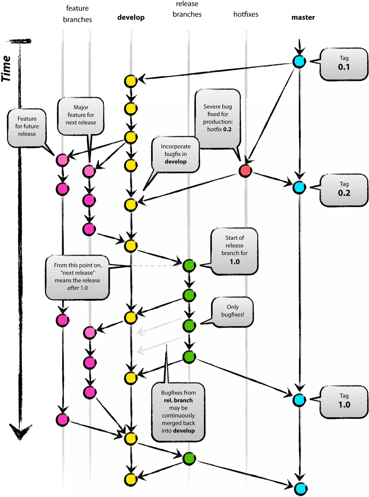

## 1.2 Git Flow常用分支

- **Production 分支**: 也就是我们经常使用的Master分支，这个分支最近发布到生产环境的代码，最近发布的Release， **这个分支只能从其他分支合并，不能在这个分支直接修改**. 所有在Master分支上的Commit应该Tag


- **Develop 分支**: 这个分支是我们是我们的主开发分支，包含所有要发布到下一个Release的代码，这个主要合并与其他分支，比如Feature分支

- **Feature 分支**: 这个分支主要是用来开发一个新的功能，一旦开发完成，我们合并回Develop分支进入下一个Release

- **Release分支**: 当你需要一个发布一个新Release的时候，我们基于Develop分支创建一个Release分支，完成Release后，我们合并到Master和Develop分支

- **Hotfix分支**: 当我们在Production发现新的Bug时候，我们需要创建一个Hotfix, 完成Hotfix后，我们合并回Master和Develop分支，所以Hotfix的改动会进入下一个Release

## 1.3 工作流程

- **初始化**: 首先所有在Master分支上的Commit应该打Tag:
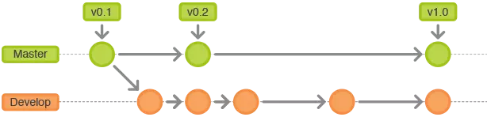

- **Feature分支**: 进行开发之前首先创建feature分支, 所有的开发工作都应该在Feature分支上进行. 做完后，必须合并回Develop分支, 合并完分支后一般会删点这个Feature分支，但是我们也可以保留:
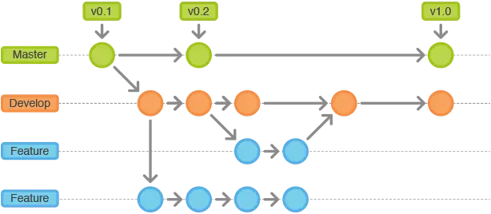

- **Release分支**: Release分支基于Develop分支创建，打完Release分支之后，我们可以在这个Release分支上测试，修改Bug等。同时，其它开发人员可以基于开发新的Feature (**记住：一旦打了Release分支之后不要从Develop分支上合并新的改动到Release分支**) 发布Release分支时，合并Release到Master和Develop， 同时在Master分支上打个Tag记住Release版本号，然后可以删除Release分支了。
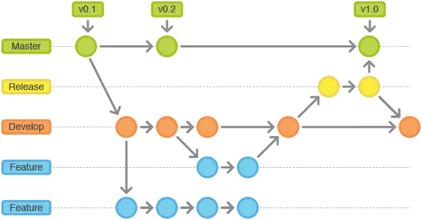

- **Hotfix 维护分支**: hotfix分支基于Master分支创建，开发完后需要合并回Master和Develop分支，同时在Master上打一个tag
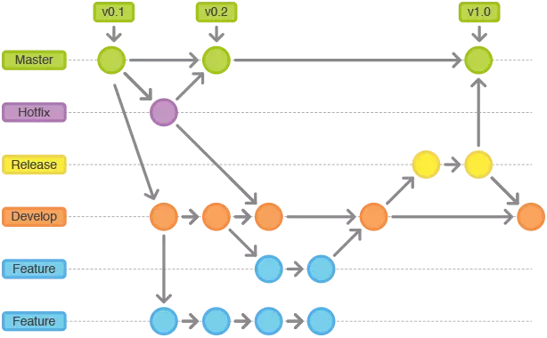

# 2. Git Flow实战

下面的实战是按照以下的博客总结进行的: 

[Learn Version Control with Git](https://www.git-tower.com/learn/git/ebook/cn/command-line/advanced-topics/git-flow)

[git flow的使用](https://www.jianshu.com/p/36292d36e41d)

[团队协作中的 Github flow 工作流程](https://zhuanlan.zhihu.com/p/39148914), 好像是找到的基于Github比较好的实践了, 但是这里似乎轮子哥对Master / Develop两个branch并不是很同意...

## 2.1 安装git flow

Git Flow是有一个辅助工具的:

```sh
sudo apt-get install git-flow
```

这个工具会按照Git Flow的流程把多个操作整合成一个命令

## 2.2 一个新的仓库

如果需要进行开发的是一个已有的主仓库, 那首先需要在Github上去fork主仓库到自己的Github中, 然后再通过`git clone`拉到本地进行开发. 使用`git remote -v`查看当前远程仓库的地址, 如果是fork的仓库需要设置一个upstream, 的上游地址，也就是我们项目主仓库的地址, 命令行执行：

```sh
git remote add upstream git@github.com:yhfeng1995/git_flow_test.git
```

这样如果上游的主仓库因为pull request变动后, 本地的仓库, 以及远程fork的origin仓库可以及时的更新, 需要同步的话运行下面几条命令:

```
git fetch upstream
git checkout master
git merge upstream/master
git push origin master
```

前三步更新了本地的仓库, 后一步更新了远程fork的origin仓库, **当你向上游push代码的时候, 一定要检查你的仓库是否是最新的!**

之后使用git flow初始化相应的配置:

```sh
git flow init
```

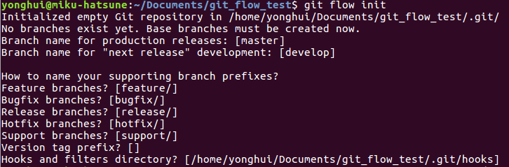

这会初始化项目对应的前缀, 保持默认的设置就可以~

## 2.3 feature开发

初始化好设置后就能开始自己的开发了, 不要忘了我们需要在feature branch中进行自己的开发, 保证time line不乱, 利用git flow可以很方便创建一个feature branch:

```sh
git flow feature start introduction
```
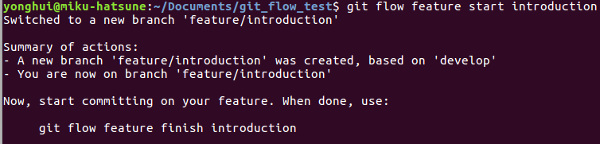

这创建了一个feature/introduction的branch, 并把header移动到了该branch上, 之后就是进行开发, 然后commit了.

如果是fork的库在完成开发工作后, 需要push feature branch, 这时候需要检查当前的feature branch是否有落后于上游(upstream)的最新develop分支:

```sh
git checkout develop
git pull
git log feature/introduction..develop
```

这里同步了develop分支, 如果没有输出任何提交信息的话，即表示 feature/introduction 分支 相对于 develop 分支 是 最新（up-to-date）的。有输出的话, 执行merge操作

```sh
git merge --no-ff
```

最后就是往自己fork的远程仓库(origin)中push了:

```
git push origin feature/introduction
```

## 2.4 pull request

自己origin仓库整完了之后, 需要向上游主仓库的**develop**分支提交申请, 交给上游主仓库的维护者去merge pull request, 一般的选择是**Create a merge commit**, 这边感兴趣的可以看[团队协作中的 Github flow 工作流程](https://zhuanlan.zhihu.com/p/39148914)对三种merge方式的介绍

## 2.5 合并Develop分支

如果是fork库在pull request被merge后, 可以删除本地和远程的feature分支了:

```sh
git branch -D feature/introduction
git push origin :feature/introduction
```

然后从上游仓库同步develop分支:

```sh
git checkout develop
git pull upstream develop
git push origin develop
```

如果是本地的feature branch完成开发, 需要合并到自己的develop branch中, 可以使用git flow的命令:

```sh
git flow feature finish introduction
```

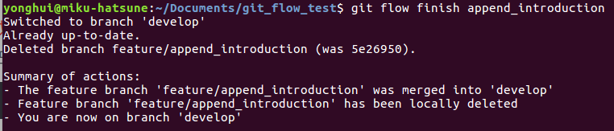

## 2.6 发布

如果develop上功能开发的差不多了, 准备需要合并到master进行发布了, 这时候需要开一个release分支, 进行发布最后的准备工作:

```sh
git flow release start 0.1.0
```

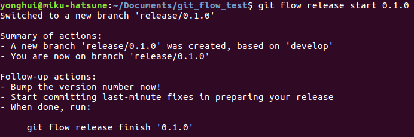

这里面可以做一些修改, 比如更新版本号, 修改BUG之类的. 修改完成之后, 如果origin库不是主仓库, 理论上可以向主仓库发出pull request申请, 但我没有看到有教程这么做的, 现在最好还是只向develop合并, 最后, 从develop向master合并由主仓库的维护者来进行, 在本地的release分支执修改完成后执行:

```sh
git flow release finish 0.1.0
```

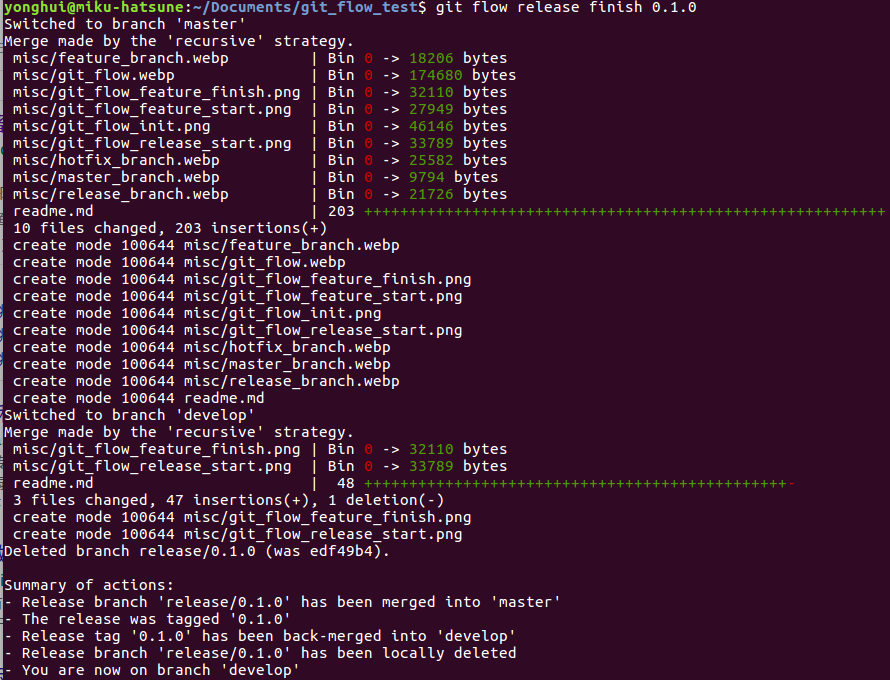

这里上次feature finish的时候我忘了commit了, 所以这么多更新...这个指令会分别将当前release/0.1.0分支合并到master分支和develop分支, 同时给master的commit打上'0.1.0'的版本标签最后删除release的分支.

到这里本地的发布工作算是完成了, 需要push到主仓库中:

```sh
git pull origin
git push origin master
git push origin develop
git push --tags
```

## 2.7 hotfix

如果release的版本出现了问题, 需要修改时候, 应该创建一个特定的hotfix线程, 维护者执行下面命令:
```sh
git flow hotfix start 0.1.2
```

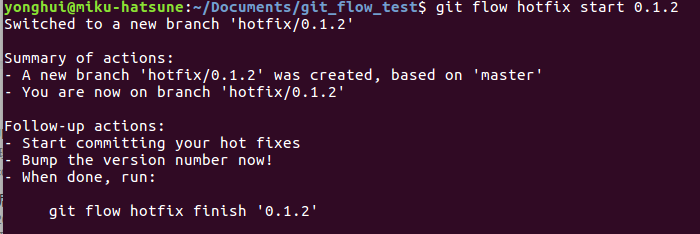
 
 这个是从master分支创建出来的, 不是develop分支, 因此不能使用feature或者release分支来代替, 并且注意hotfix会更新tag, 所以branch的名字最好和版本号统一起来.

 修改完事后, 需要合并回master分支:

 ```sh
 git flow hotfix finish add_hotfix_image
 ```

 这个指令会将hotfix合并到master和Develop分支中, 然后删除分支, 回到develop分支上